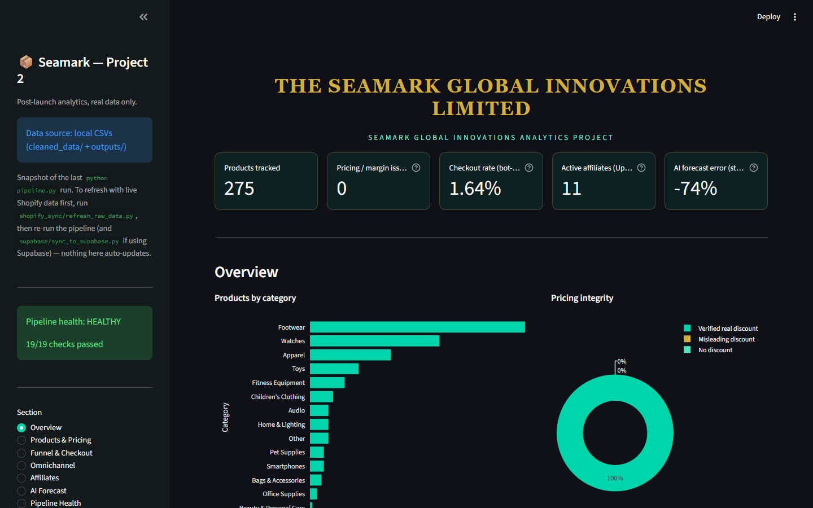
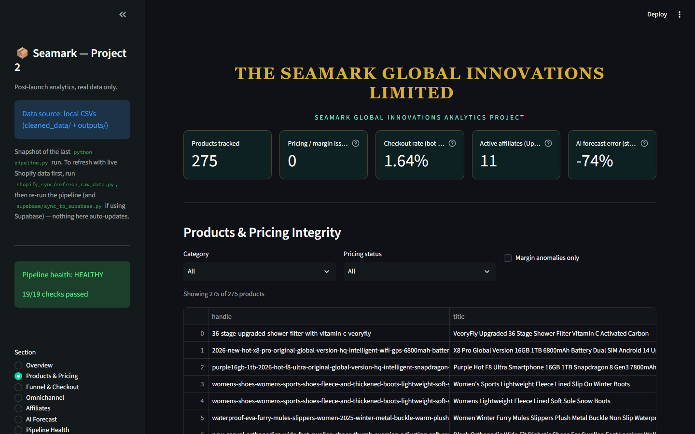
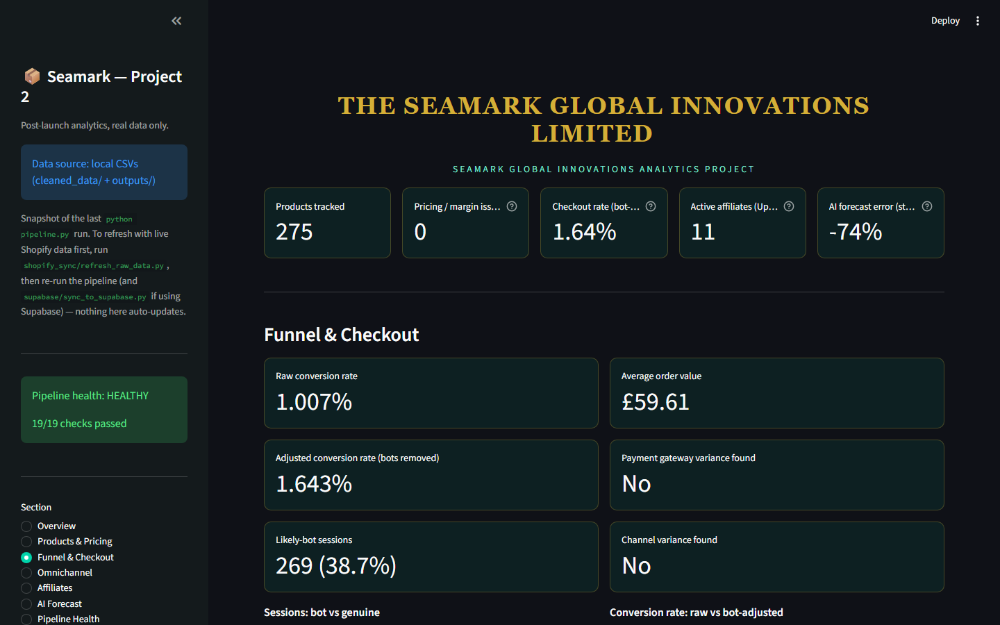
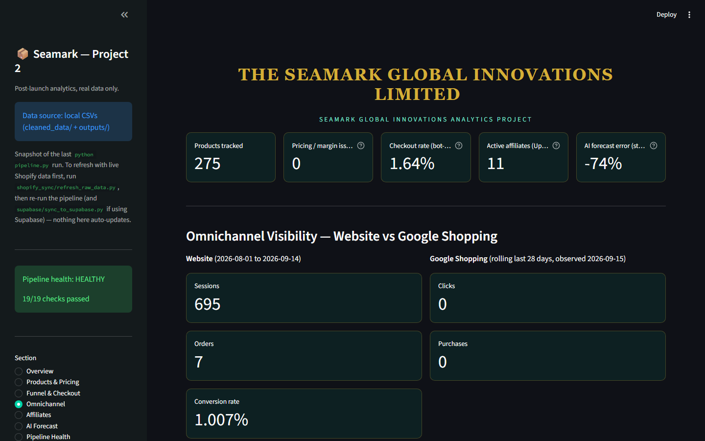
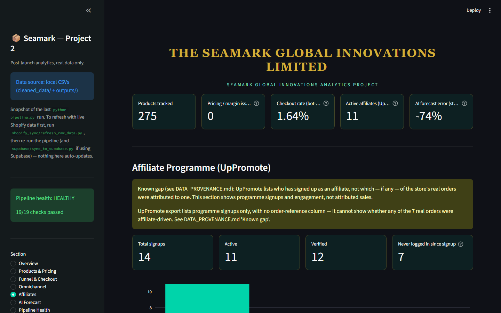
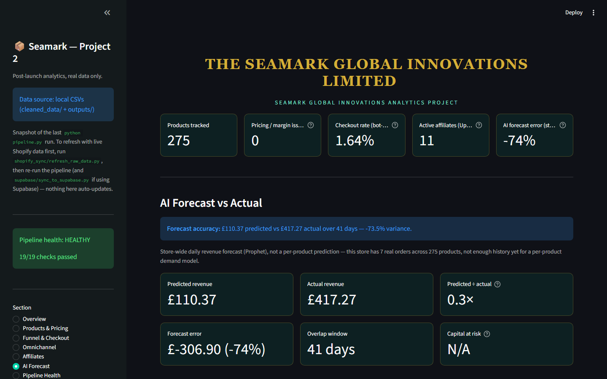
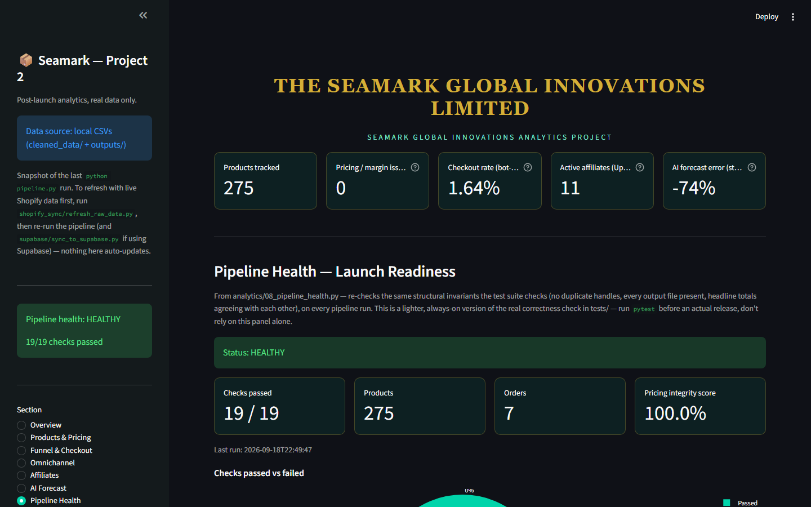
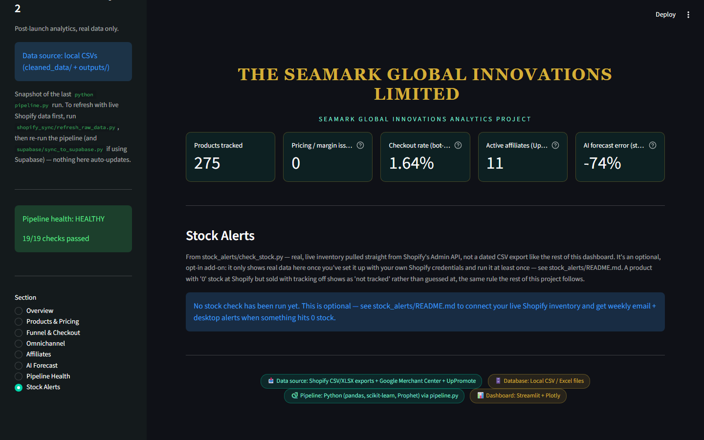

# Seamark Global Innovations — Post-Launch Data Science Project (Project 2)

Author: Sunday Emmanuel Azeez (with Claude)

This is a real-data analysis of Seamark's relaunched Shopify store. It covers product classification, pricing integrity, the checkout funnel and bot-traffic adjustment, forecast-vs-actual revenue, omnichannel visibility, and affiliate signups, all served through a numbered pipeline, a Flask API, and a Streamlit dashboard. Every number traces back to a real export listed in `DATA_PROVENANCE.md`. Nothing on the dashboard, in the API, or in `outputs/` is simulated. The point of this README is that anyone can clone it, install it, and run the whole thing without hitting an error, not just someone who's been following along the whole time.

## Dashboard

These are full-page captures of every section in `streamlit run dashboard/app.py`, taken from a live run against this project's own real data. No mockups. If you want to regenerate them after a data refresh, see `dashboard/capture_screenshots.py`.

### Overview


### Products & Pricing


### Funnel & Checkout


### Omnichannel


### Affiliates


### AI Forecast


### Pipeline Health


### Stock Alerts


## Project structure

```
analytics/     10 numbered stages — the actual analysis (run via pipeline.py)
api/           Flask API that serves the pipeline's outputs as JSON
dashboard/     Streamlit dashboard — the single-screen view of everything
supabase/      Optional: push pipeline outputs to Supabase for a hosted dashboard
stock_alerts/  Optional: weekly live Shopify stock check, with email +
               desktop out-of-stock alerts — separate from pipeline.py
               on purpose, since it's the one thing here that calls a
               live API instead of reading a dated export
tests/         pytest suite — re-derives every number independently and checks it
raw_data/      Real Shopify/UpPromote/Google Merchant Center exports, plus
               raw_data/external_olist/ — a real external dataset used only
               for one labelled comparison chart, never blended into
               Seamark's own numbers (see DATA_PROVENANCE.md)
cleaned_data/  Stage 1's output — the cleaned products/orders/customers
outputs/       Every other stage's output CSVs — what the API/dashboard read
```

There isn't one single `requirements.txt` for the whole project. The pipeline, the API, the dashboard, and the Supabase sync each have their own, because most people running this only need one of them. Install whichever one you actually need, following the steps below.

## Quick start — analytics pipeline only

```
pip install -r requirements.txt
python pipeline.py
python -m pytest tests/ -v
```

`pipeline.py` runs all 10 stages in order and prints `[OK]` or `[FAIL]` for each one at the end. If a stage fails with `ModuleNotFoundError`, it just means a package from `requirements.txt` isn't installed in whichever Python environment you're running. Re-run the `pip install` line above, in that same environment, and try again.

The test suite doesn't trust the pipeline's own arithmetic. Every test file recomputes its numbers independently from `raw_data/`/`cleaned_data/` and checks that the saved output agrees. So a passing suite means the outputs are actually correct, not just that the scripts ran without crashing.

## Quick start — dashboard

```
python pipeline.py                     # if you haven't already
pip install -r dashboard/requirements.txt
streamlit run dashboard/app.py
```

Full details, including the optional Supabase-backed setup for a hosted dashboard, are in `dashboard/README.md`.

## Quick start — API

```
pip install -r api/requirements.txt
python api/main.py
```

Full endpoint list and honest-scope notes are in `api/README.md`.

## Quick start — stock alerts (optional)

Everything above reads a dated CSV export. This one's different: it checks your **live** Shopify inventory once a week and emails plus notifies you if anything's hit 0 stock. It needs your own Shopify Admin API credentials, so it's opt-in and not part of `pipeline.py`. Full setup (getting a Shopify token, an email app password, and scheduling it weekly on Windows) is in `stock_alerts/README.md`.

## If something fails on a fresh machine

1. Check you're installing into the same Python environment you're running scripts from. Running `pip install X` in one environment and `python script.py` in another is the most common cause of a `ModuleNotFoundError` that looks like a real bug but isn't.
2. Run the pipeline stage that failed on its own (`cd analytics && python 0X_whatever.py`) to see the full traceback, rather than the trimmed error `pipeline.py` prints.
3. Run stages in order. `pipeline.py` does this for you automatically, but running an analytics script by hand out of order (Stage 4 before Stage 1, say) will fail, because later stages read earlier stages' output files.
4. Nothing here reads from or writes to any path outside this project folder, and nothing is hardcoded to a specific machine or OS. If you hit a path error, it's almost certainly #3, not some difference in your environment.

## Honest scope — read before trusting a number for something real

This project is deliberately conservative about what it claims:

- The AI Forecast is a real **store-wide** revenue forecast (from Project 1's Prophet model), checked against real actual revenue. It's not a per-product prediction. This store has 7 real orders across 275 products, nowhere near enough history for a per-SKU forecast that wouldn't just be fabricated precision.
- Affiliate numbers are UpPromote signup and engagement counts, not order attribution. UpPromote's export doesn't have an order-reference column to attribute from.
- Bot-traffic flagging is a documented heuristic (data-center-town matching), not a claim of certainty. See `BOT_MITIGATION_README.md` for how it works.
- No static inventory-quantity export exists, so nothing in the core pipeline or dashboard claims a dead-stock or stockout count from a dated file. The one exception is the optional `stock_alerts/` add-on. It reads real, live stock levels straight from Shopify's Admin API, but only once you've set up your own Shopify credentials for it (see `stock_alerts/README.md`). It's opt-in, not part of the core pipeline's own data.
- The external category benchmark (Olist Brazilian E-Commerce dataset, 2016–2018) is a labelled reference point against one large, real, unrelated business. It's not a prediction, and it's never used to adjust the AI Forecast or any other Seamark number.

`DATA_PROVENANCE.md` has the full source-by-source breakdown of every raw file used, what was verified against what, and what was explicitly excluded and why.
